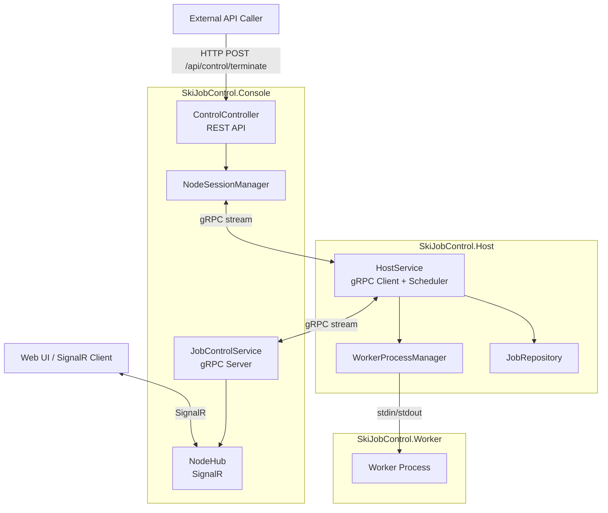

# SkiJobControl / Distributed Job Orchestration System

SkiJobControl 是一個以 .NET 8 建置的分散式工作任務控制系統，透過 **Console**、**Host**、**Worker** 三層協作，完成節點狀態回報、任務派發與遠端控制。

## 架構圖



## 系統說明

### Console
- 中央控制台，負責接收 Host 的 gRPC 串流連線。
- 將節點狀態透過 SignalR 推送給 Web UI。
- 提供 REST API 用於遠端控制，例如終止指定 Worker。

### Host
- 部署在節點機器上的代理程式。
- 週期性回報 CPU、RAM 與 Worker 狀態。
- 維護本機 Worker 進程池，並從 JobRepository 取出任務分派給空閒 Worker。
- 接收 Console 下發的控制命令並執行。
- 每 10 秒輸出一次健康檢查日誌，包含 Session 存活狀態、最近狀態回報時間、最近命令接收時間、最近 gRPC 錯誤時間、Worker 池大小與活躍 Worker 數。

### Worker
- 實際執行任務的獨立進程。
- 透過 stdin/stdout 與 Host 通訊。
- 支援 `START_JOB`、`TERMINATE` 等指令。

### Core
- 共用資料模型與 Repository 實作。
- 目前包含 `FileJobRepository` 與 Oracle 版 `OracleJobRepository`。

### Protos
- 定義 gRPC 介面與訊息格式。
- `JobControlService.OpenSession` 為 Console 與 Host 的雙向串流入口。

## 主要流程

1. **狀態回報**：Host 每 2 秒送出 `NodeStatus`，Console 收到後廣播到 Web UI。
2. **任務分派**：Host 每 3 秒檢查空閒 Worker，從 Repository 取出待處理工作並送出 `START_JOB`。
3. **遠端控制**：外部系統呼叫 `POST /api/control/terminate`，Console 透過 gRPC 對指定 Node 下達終止 Worker 指令。

## 專案結構

- `SkiJobControl.Console`：Web/API、gRPC Server、SignalR
- `SkiJobControl.Host`：節點代理、Worker 池管理、任務派發
- `SkiJobControl.Worker`：工作進程
- `SkiJobControl.Core`：共用模型與 Repository
- `SkiJobControl.Protos`：gRPC 定義
- `SkiJobControl.Tests`：測試專案

## 執行方式

### 一鍵啟動（Demo 用）

```bat
start_system.bat
```

雙 Host 模擬（同機啟動 2 個 Host）：

```bat
start_system_2hosts.bat
```

執行後會自動：
1. 清理殘留的 Host/Console 進程（避免埠 5249/5250 佔用）
1. 建置整個 solution
2. 開啟 Console（Web UI / gRPC Server）
3. 等待 Console 就緒（8 秒）
4. 開啟 Host（Worker 池 + gRPC Client 連上 Console）
5. 自動開啟瀏覽器至 Web UI

## 多 Host 模擬與 Job 分派

1. 執行 `start_system_2hosts.bat`。
2. 開啟 Web UI (`http://localhost:5249`)。
3. 在上方工具列輸入 Job 筆數 / 前綴，點擊 `產生模擬 Job`。
4. 觀察：
    - Node 區塊會顯示 2 個不同 NodeId（代表 2 個 Host）。
    - Worker 狀態會切換為 `Running` / `Idle`。
    - 下方 `系統事件 Log` 會顯示節點連線、工作狀態變更、指令與 Job 佇列事件。

### 手動啟動

#### Console
```bash
cd SkiJobControl.Console
dotnet run --no-launch-profile
```

- Web UI：`http://localhost:5249`
- Swagger：`http://localhost:5249/swagger`
- gRPC：`http://localhost:5250`（供 Host 連線用）

#### Host
```bash
cd SkiJobControl.Host
dotnet run --no-launch-profile
```

預設連到 Console 的 gRPC 端點：`http://localhost:5250`

Host 會每 10 秒輸出健康檢查資訊，日誌關鍵字為：`HealthCheck`。
常見欄位：
- `SessionAlive`：目前 gRPC session 是否存活
- `SessionUptimeSec`：本次 session 已持續秒數
- `LastStatusSentSecAgo`：距離上次狀態回報秒數
- `LastCommandSecAgo`：距離上次收到控制命令秒數（未收到時為 -1）
- `LastGrpcErrorSecAgo`：距離上次 gRPC 錯誤秒數（未發生時為 -1）

## 設定重點

- `SkiJobControl.Console` 監聽：
  - HTTP/1：`5249`
  - HTTP/2 (gRPC)：`5250`
- `SkiJobControl.Host/appsettings.json` 可調整：
  - `WorkerPath`
  - `MinPoolSize`
  - `ConsoleUrl`

### 共用 Job 檔案（本機模擬）

- Host 與 Console 預設共用：`../shared/jobs_mock.json`
- Worker 會透過環境變數 `SKIJOBCONTROL_JOB_FILE_PATH` 使用同一份 Job 檔案

