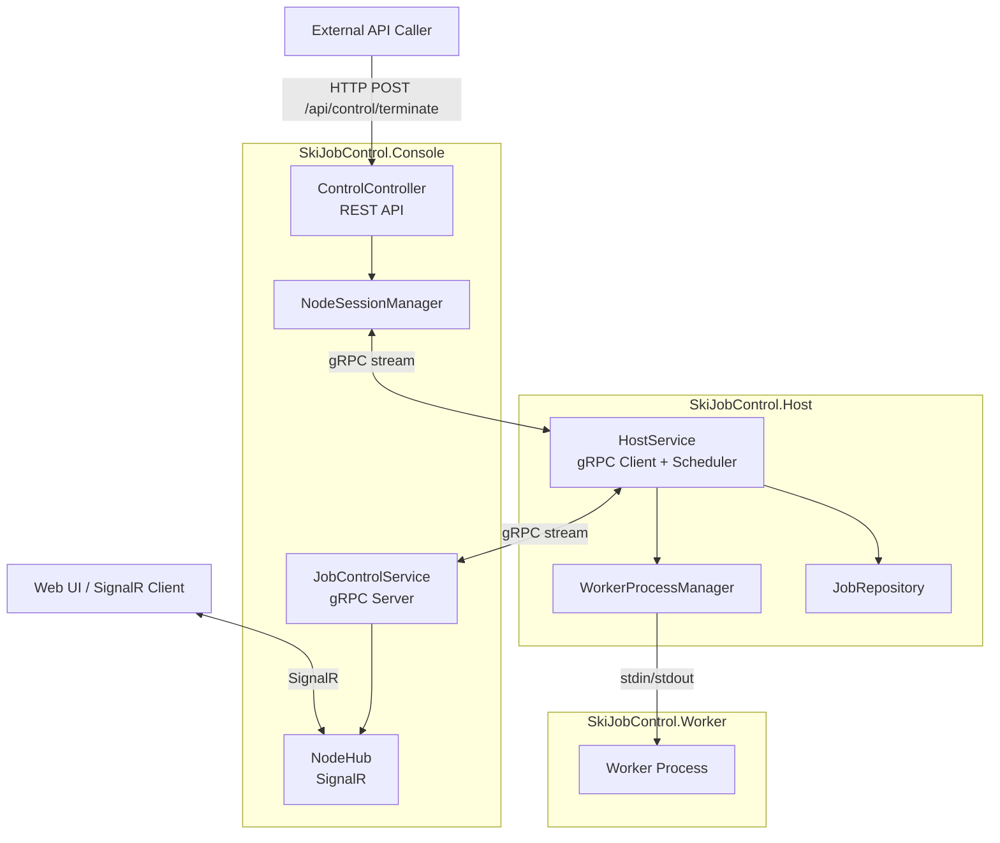

# SkiJobControl / Distributed Job Orchestration System

SkiJobControl 是一個以 .NET 8 建置的分散式工作任務控制系統，透過 **Console**、**Host**、**Worker** 三層協作，完成節點狀態回報、任務派發與遠端控制。

## 架構圖



## 系統說明

### Console
- 中央控制台，負責接收 Host 的 gRPC 串流連線。
- 將節點狀態透過 SignalR 推送給 Web UI。
- 提供 REST API 用於遠端控制，例如終止指定 Worker。

### Host
- 部署在節點機器上的代理程式。
- 週期性回報 CPU、RAM 與 Worker 狀態。
- 維護本機 Worker 進程池，並從 JobRepository 取出任務分派給空閒 Worker。
- 接收 Console 下發的控制命令並執行。

### Worker
- 實際執行任務的獨立進程。
- 透過 stdin/stdout 與 Host 通訊。
- 支援 `START_JOB`、`TERMINATE` 等指令。

### Core
- 共用資料模型與 Repository 實作。
- 目前包含 `FileJobRepository` 與 Oracle 版 `OracleJobRepository`。

### Protos
- 定義 gRPC 介面與訊息格式。
- `JobControlService.OpenSession` 為 Console 與 Host 的雙向串流入口。

## 主要流程

1. **狀態回報**：Host 每 2 秒送出 `NodeStatus`，Console 收到後廣播到 Web UI。
2. **任務分派**：Host 每 3 秒檢查空閒 Worker，從 Repository 取出待處理工作並送出 `START_JOB`。
3. **遠端控制**：外部系統呼叫 `POST /api/control/terminate`，Console 透過 gRPC 對指定 Node 下達終止 Worker 指令。

## 專案結構

- `SkiJobControl.Console`：Web/API、gRPC Server、SignalR
- `SkiJobControl.Host`：節點代理、Worker 池管理、任務派發
- `SkiJobControl.Worker`：工作進程
- `SkiJobControl.Core`：共用模型與 Repository
- `SkiJobControl.Protos`：gRPC 定義
- `SkiJobControl.Tests`：測試專案

## 執行方式

### Console
```bash
cd SkiJobControl.Console
dotnet run
```

- Web UI：`http://localhost:5249`
- Swagger：`http://localhost:5249/swagger`

### Host
```bash
cd SkiJobControl.Host
dotnet run
```

預設會連到 Console 的 gRPC 端點：`http://0.0.0.0:5250`

## 設定重點

- `SkiJobControl.Console` 監聽：
  - HTTP/1：`5249`
  - HTTP/2 (gRPC)：`5250`
- `SkiJobControl.Host/appsettings.json` 可調整：
  - `WorkerPath`
  - `MinPoolSize`
  - `ConsoleUrl`

