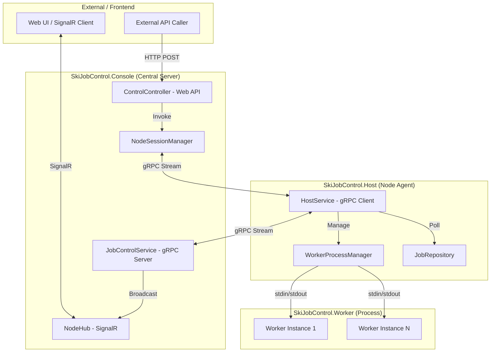
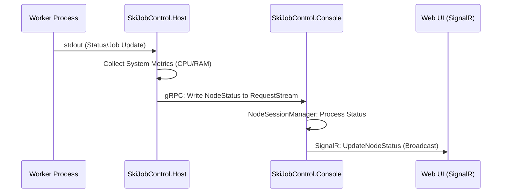
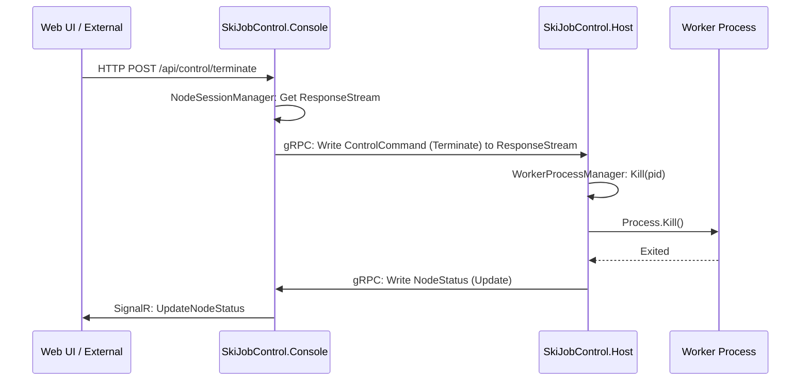
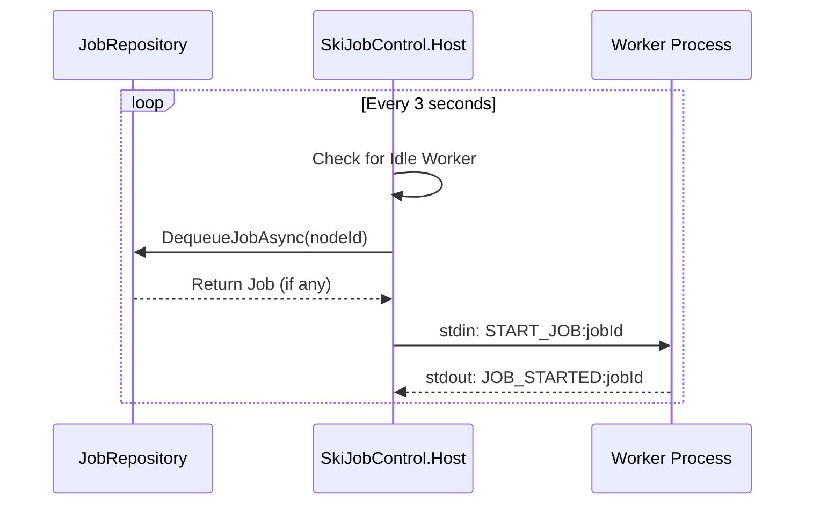

# SKERPAPI 系統架構說明書 (Architecture Document)

## 1. 系統概覽
SKERPAPI (SkiJobControl) 是一個分散式工作任務控制系統，旨在管理分散在不同節點 (Node) 上的工作程序 (Worker)。系統採用的核心技術包括 ASP.NET Core, gRPC, SignalR 以及 .NET 8。

### 1.1 系統架構圖 (System Architecture)

## 2. 核心組件說明

### 2.1 中央控制台 (SkiJobControl.Console)
*   **角色**: 系統的核心大腦，負責協調所有節點。
*   **技術棧**: ASP.NET Core Web API, gRPC Server, SignalR Hub.
*   **主要功能**:
    *   接收來自節點的即時狀態報告 (gRPC Bidirectional Stream)。
    *   將節點狀態即時推送給前端 Web UI (SignalR)。
    *   提供 REST API 供外部系統或 UI 下達控制指令 (如終止特定 Worker)。
    *   管理節點連線會話 (`NodeSessionManager`)。

### 2.2 節點代理 (SkiJobControl.Host)
*   **角色**: 運行在各個工作機器上的代理程序。
*   **技術棧**: .NET Worker Service, gRPC Client.
*   **主要功能**:
    *   連線至中央控制台並開啟雙向流會話。
    *   監控本機系統資源 (CPU, RAM) 並定時回報。
    *   管理本機 Worker 進程池 (`WorkerProcessManager`)。
    *   從任務儲存庫 (`JobRepository`) 獲取待處理任務並分派給空閒 Worker。
    *   執行來自控制台的遠端指令 (如 Kill Process)。

### 2.3 工作進程 (SkiJobControl.Worker)
*   **角色**: 實際執行業務邏輯的獨立進程。
*   **主要功能**:
    *   由 Host 啟動與管理。
    *   透過標準輸入輸出 (stdin/stdout) 與 Host 溝通狀態與指令。

### 2.4 通訊協定 (SkiJobControl.Protos)
*   **角色**: 定義 gRPC 服務契約。
*   **服務定義**: `JobControlService`
    *   `OpenSession`: 雙向流，用於狀態回報與指令下達。

### 2.5 核心邏輯 (SkiJobControl.Core)
*   **角色**: 共享的模型與邏輯。
*   **組件**:
    *   `JobRepository`: 任務排程與獲取邏輯。
    *   `Models`: 系統通用的資料模型。

## 3. 通訊與資料流

### 3.1 狀態回報流程 (Status Reporting)
1.  **Host** 定期 (2秒) 收集本機資源與 Worker 狀態。
2.  **Host** 透過 gRPC `OpenSession` 串流發送 `NodeStatus` 給 **Console**。
3.  **Console** 接收後，透過 `NodeHub` (SignalR) 將訊息廣播給所有訂閱的 Web 用戶。

#### 循序圖：狀態回報

### 3.2 遠端控制流程 (Remote Control)
1.  **Web UI/External** 呼叫 **Console** 的 REST API (`/api/control/terminate`)。
2.  **Console** 透過 `NodeSessionManager` 尋找目標節點的 gRPC 會話。
3.  **Console** 透過 gRPC 流發送 `ControlCommand` 給 **Host**。
4.  **Host** 接收指令後，呼叫 `WorkerProcessManager` 終止指定的進程。

#### 循序圖：遠端指令 (Terminate Worker)

### 3.3 任務分派流程 (Job Dispatching)
1.  **Host** 定期 (3秒) 檢查是否有空閒 Worker。
2.  若有空閒，則向 **JobRepository** 請求任務。
3.  獲取任務後，**Host** 透過 stdin 發送指令給 **Worker** 開始執行。

#### 循序圖：任務分派

## 4. 部署架構
*   **Console** 部署在中心伺服器，需暴露 HTTP/1 (5249) 與 HTTP/2 (5250) 埠。
*   **Host** 部署在多台工作伺服器，需能連線至 Console。
*   **Worker** 必須與 Host 位於同一目錄或在 PATH 中。
